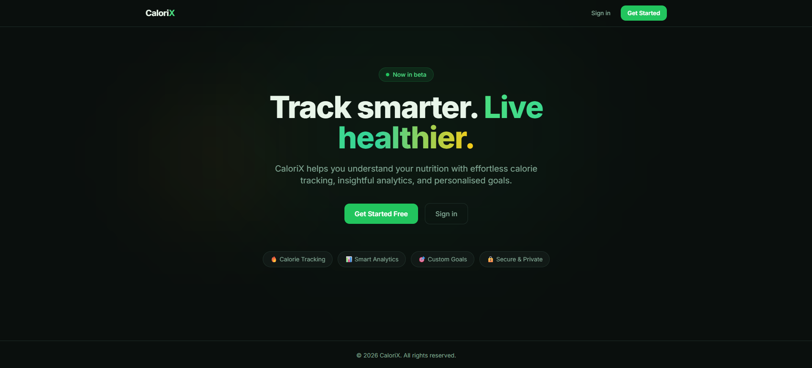
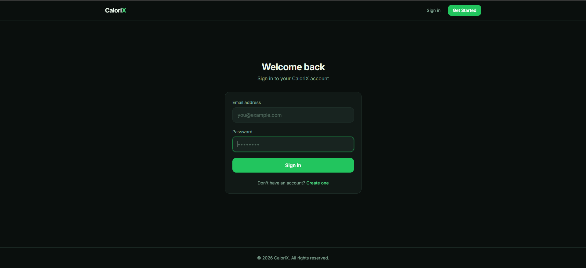
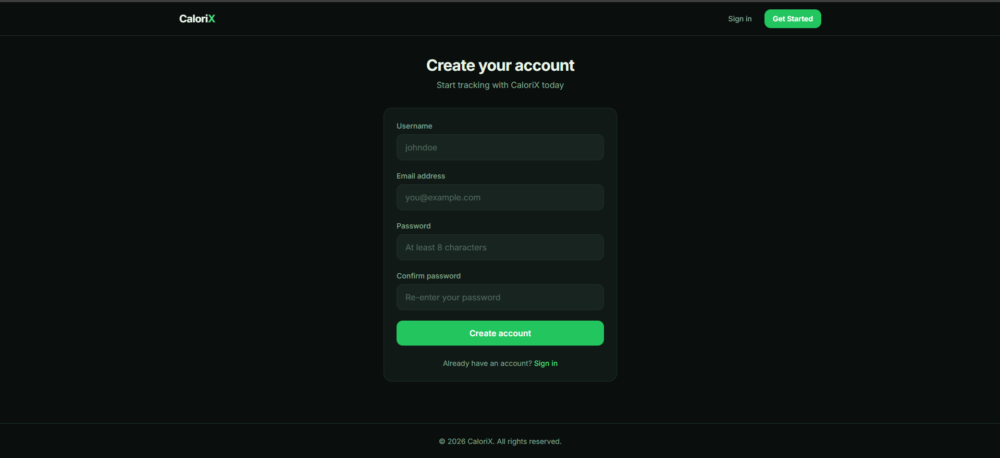
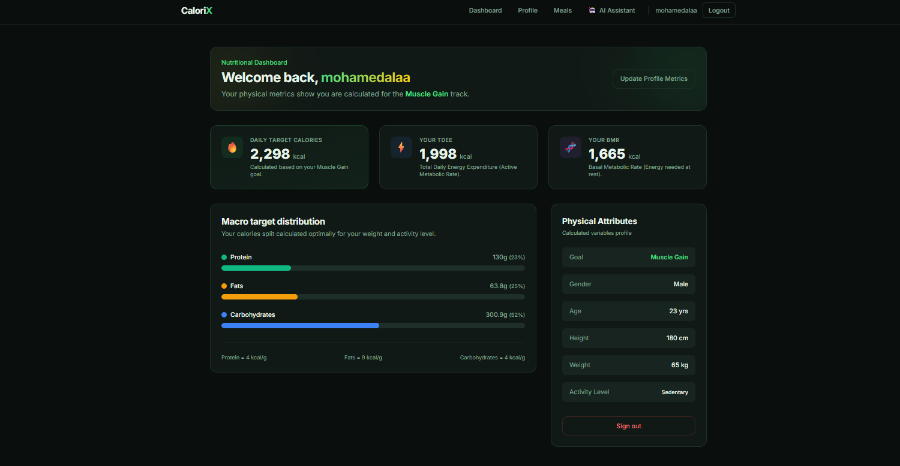
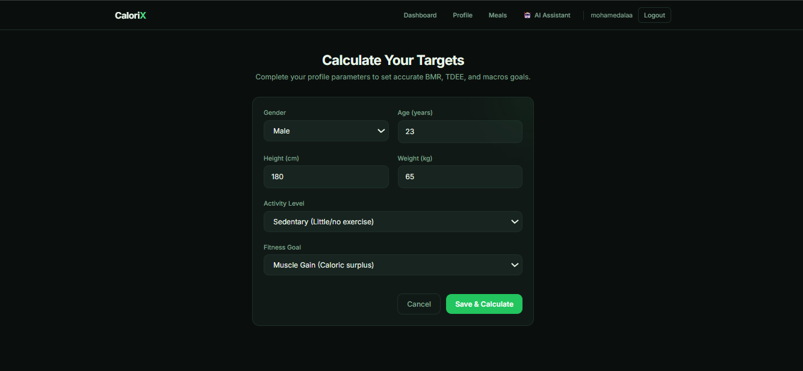
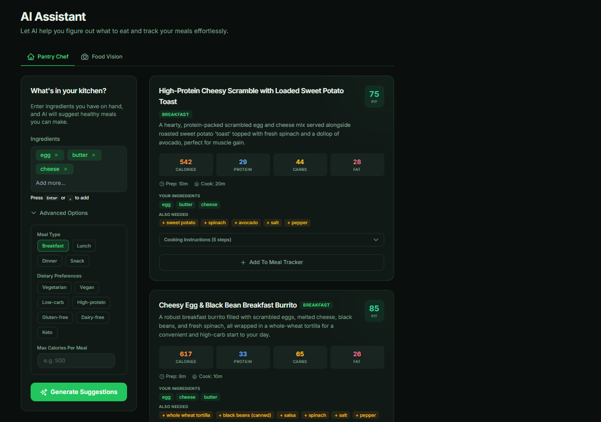
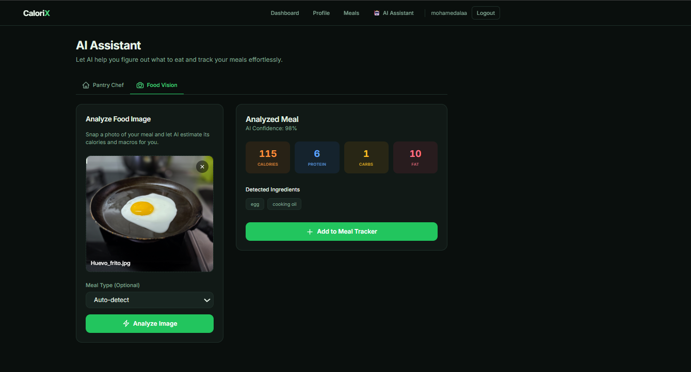

# 🔥 CaloriX

<p align="center">
  <h3 align="center">AI-Powered Calorie Tracking & Nutrition Assistant</h3>

  <p align="center">
    Track smarter. Live healthier.
    <br />
    Personalized nutrition tracking powered by AI.
  </p>
</p>

---

## 📌 Overview

CaloriX is a full-stack calorie tracking and nutrition management platform that combines traditional calorie counting with modern AI capabilities.

The platform allows users to:

- Track calories and macronutrients
- Calculate BMR and TDEE automatically
- Set personalized fitness goals
- Receive AI-generated meal suggestions
- Analyze food images using computer vision
- Manage nutrition data through an intuitive dashboard

---

## ✨ Features

### 🔐 Authentication & Security
- JWT Authentication
- Access & Refresh Tokens
- Password hashing with bcrypt
- Protected API routes

### 📊 Personalized Nutrition Dashboard
- Automatic BMR calculation
- TDEE calculation
- Daily calorie target generation
- Personalized macro distribution
- Goal-based recommendations

### 🎯 Fitness Goals
- Weight Loss
- Maintenance
- Muscle Gain

### 🤖 AI Pantry Chef
Generate personalized meals from ingredients already available in your kitchen.

Features include:
- Ingredient-based meal generation
- Macro-aware recommendations
- Meal type filtering
- Dietary preference filtering
- Calorie limit support

### 📷 AI Food Vision
Upload food images and receive:

- Estimated calories
- Protein amount
- Carbohydrates
- Fat content
- Ingredient detection
- AI confidence score

### 📚 Developer Friendly APIs
- Fully documented Swagger API
- OpenAPI support
- Modular architecture
- Clean service layer design

---

## 📸 Screenshots

### Landing Page



---

### Login Page



---

### Registration Page



---

### Dashboard



---

### Profile & Goal Calculation



---

### AI Pantry Chef

Generate meals from available ingredients.



---

### AI Food Vision

Analyze food images using Google Gemini Vision.



---

## 🏗 Architecture

```text
CaloriX
│
├── Frontend (React + Vite)
│
├── Backend (FastAPI)
│
├── SQLite Database
│
└── Google Gemini AI
    ├── Meal Suggestions
    └── Food Vision Analysis
```

---

## 🛠 Tech Stack

### Frontend
- React 18
- Vite
- TailwindCSS
- Axios
- React Router DOM

### Backend
- FastAPI
- SQLAlchemy
- Pydantic
- JWT Authentication
- bcrypt

### Database
- SQLite

### AI
- Google Gemini API
- Gemini Flash
- Gemini Vision

---

## 📁 Project Structure

```text
CaloriX/
│
├── backend/
│   ├── app/
│   │   ├── api/
│   │   ├── auth/
│   │   ├── core/
│   │   ├── database/
│   │   ├── models/
│   │   ├── schemas/
│   │   ├── services/
│   │   ├── utils/
│   │   └── main.py
│   │
│   ├── requirements.txt
│   └── .env.example
│
├── frontend/
│   ├── src/
│   │   ├── components/
│   │   ├── context/
│   │   ├── hooks/
│   │   ├── layouts/
│   │   ├── pages/
│   │   └── services/
│   │
│   ├── package.json
│   └── vite.config.js
│
└── README.md
```

---

# 🚀 Getting Started

## Clone Repository

```bash
git clone https://github.com/MohameedAlaa/CaloriX.git
cd CaloriX
```

---

## Backend Setup

```bash
cd backend

python -m venv venv

venv\Scripts\activate

pip install -r requirements.txt
```

Create `.env`

```env
APP_NAME=CaloriX
DEBUG=true

DATABASE_URL=sqlite:///./calorixx.db

SECRET_KEY=your_secret_key_here

CORS_ORIGINS=["http://localhost:5173"]

GEMINI_API_KEY=your_gemini_api_key
```

Run Backend:

```bash
uvicorn app.main:app --reload
```

Backend URL:

```text
http://127.0.0.1:8000
```

Swagger Documentation:

```text
http://127.0.0.1:8000/docs
```

---

## Frontend Setup

```bash
cd frontend

npm install

npm run dev
```

Frontend URL:

```text
http://localhost:5173
```

---

## API Endpoints

### Authentication

```text
POST /api/v1/auth/register
POST /api/v1/auth/login
POST /api/v1/auth/refresh
```

### Profile

```text
GET  /api/v1/profile
POST /api/v1/profile
PUT  /api/v1/profile
```

### Meals

```text
GET  /api/v1/meals
POST /api/v1/meals
DELETE /api/v1/meals/{id}
```

### AI Services

```text
POST /api/v1/ai/suggest-meals
POST /api/v1/ai/analyze-image
```

---

## 🔮 Future Improvements

- Barcode scanner support
- OCR nutrition label detection
- Weekly analytics dashboard
- Meal history charts
- Push notifications
- Mobile application
- Cloud deployment
- Social sharing features

---

## 👨‍💻 Author

**Mohamed Alaa**

Full Stack Developer

GitHub:
https://github.com/MohameedAlaa

---

## 📄 License

MIT License